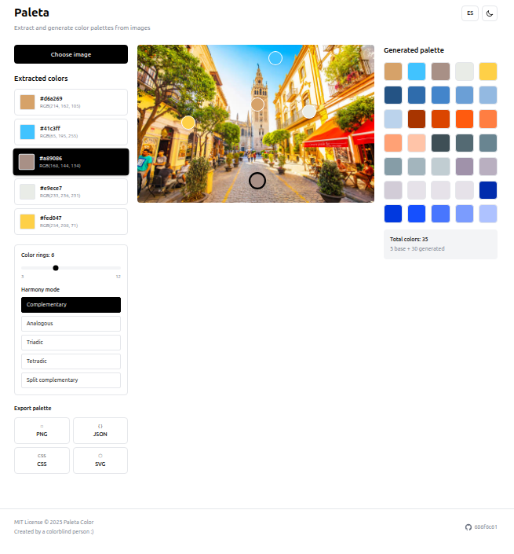
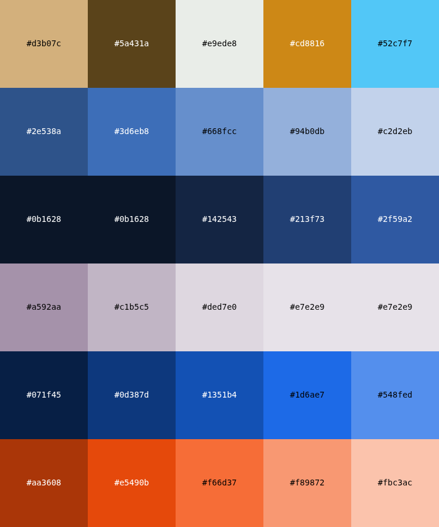

# Paleta color

A color palette generator designed for people with color blindness. Extract dominant colors from images and generate complementary palettes to help visualize and work with colors effectively.

## What it does

Upload an image and Paleta color will:

- Extract the 5 most dominant colors using k-means clustering
- Allow you to adjust color positions directly on the image with draggable indicators
- Generate complementary color palettes with configurable rings (3-12 colors)
- Provide multiple harmony modes: complementary, analogous, triadic, tetradic, and split-complementary
- Export your palette in multiple formats: PNG, JSON, CSS, and SVG

### Example of generated palette

## Why it exists

Working with colors can be challenging for people with color vision deficiencies. This tool helps by:

- Identifying exact colors from photographs
- Generating harmonious color combinations that work well together
- Providing multiple export formats for use in design and development projects
- Making it easier to communicate color choices with precision

## Features

- Real-time color extraction from uploaded images
- Interactive color picking with draggable indicators
- Dark mode support
- Bilingual interface (Spanish and English)
- Export to PNG, JSON, CSS variables, and SVG formats

## Tech stack

Built with Next.js 15, React 19, TypeScript, and Tailwind CSS.

## License

MIT License © 2025 Paleta Color

Created by a colorblind person for the colorblind community.

## Repository

[github.com/686f6c61/paleta-color](https://github.com/686f6c61/paleta-color)
